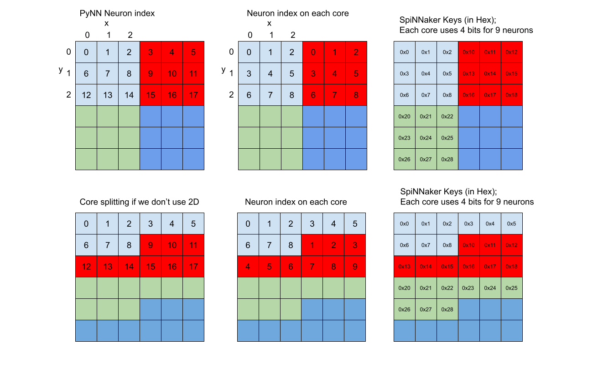

Interdimensional Compatibility
==============================

Terminology
-----------
The following terms and "variable names" (i.e. the names of variables in
pseudocode examples) are used in this document.  Note these are written as
variable names here with underscores in the names, but might also appear without
the undescore in text.

`PyNN`: Python Neural Network API.  See
[https://neuralensemble.org/PyNN/](https://neuralensemble.org/PyNN/).

`Population`: A group of neurons, as defined by PyNN.

`Projection`: A sender-receiver relationship of spikes between Populations,
as defined in PyNN.

`source_population`: The sender of spikes; the pre-Population of a Projection.

`target_population`: The receiver of spikes; the post-Population of a
Projection.

`pynn_neuron_index`: The index of the neuron within a Population.  This
is always a single index even when the Population has multiple dimensions.

`n_dimensions`: The number of dimensions of a Population e.g. 2 = 2D.

`full_size[n]`: The full size of a Population in the n'th dimension e.g. a
2D Population with width 3 and height 4 will have `full_size[0] = 3` and
`full_size[1] = 4`.

`pynn_neuron_indexes[n]`: The position of the neuron in the Population in the
n'th dimension e.g. a neuron at position (1, 2) in a 2D Population will have
`pynn_neuron_indexes[0] = 1` and `pynn_neuron_indexes[1] = 2`.

`neurons_per_core`: The total number of neurons per SpiNNaker core.

`neurons_per_cores[n]`: The number of neurons per SpiNNaker core in the n'th
dimension.

`cores_per_size[n]`: The number of cores of the Population in the n'th
dimension; this is a shorthand for `full_size[n] / neurons_per_core[n]`
(which must be an integer value by design).

`core_index`: The index of a core in a list of all cores; for multi-dimensional
Populations, this is a raster scan of the cores.

`core_indexes[n]`: The core index in the n'th dimension.

`neuron_index`: The index of the neuron in a list of all neurons on a core; for
multi-dimensional vertices, this is a raster scan of the neurons on the core.

`neuron_indexes[n]`: The local neuron index in the n'th dimension.

`key`: The SpiNNaker routing key used to send a spike to other cores and
received from other cores.  The key is determined by the source Population and
is unique for each neuron.

`population_key`: The part of a key that is shared by all keys for a
Population (see below for more details).  This is unique to a Population.

`pop_info`: A receiver of spikes stores a table of Population information for
each of the source Populations against the population key.  This includes things
like the neurons per core, the position of the population key, the position and
size of the core index in the key and the position and size of the neuron index
in the key (see below).

`synaptic_row`: A row listing the target neuron indexes on a core of a target
Population, with a row for each source PyNN neuron index.

`row_index`: The index of a synaptic row in the list of all synaptic rows as it
appears on a core of a target Population.  Note that the row index may not be
the same as the source PyNN neuron index (see later for details).

Introduction
------------
The software has been enhanced to support multi-dimensional Populations, and the
communication between these vertices which might have different dimensionality.
The order of the neurons in a Population with more than one dimension have been
chosen to be a [Raster Scan](https://en.wikipedia.org/wiki/Raster_scan) of the
neurons through each dimension e.g. in a 2D Population, the pixels are ordered
in a rows starting from top-left, where neuron 0 is (0, 0) to bottom-right where
neuron n is (w, h), where w is the width and h is the height of the Population
of n = (w x h) neurons.

This means that the user does not have to consider how the neurons are split
over the cores. The mapping should account for this internally.  Some of how
this is achieved is described below.

Splitting into cores
--------------------
When a 1-dimensional Population is split over multiple cores, it is simply split
up so that each core has a fixed number of neurons, defined by the maximum
number of neurons per core.  The last core may have less neurons if the size is
such that it does not divide by this number.  For example, with 10 neurons per
core, a 30 neuron Population will be divided into 3 cores made up of neurons
(0-9), (10-19) and (20-29), where a 25 neuron Population will be divided into 3
cores also but made up of neurons (0-9), (10-19) and (20-24), so there will only
be 5 neurons on the last core.  By default, the number of neurons per core is
256 for a neuron Population.

When a multi-dimensional Population is split over multiple cores, it will
generally be split into hyper-rectangles i.e. n-dimensional rectangles, where
each dimension is given a maximum number of neurons per core.  The restriction
here is that each dimension must be exactly divisible by the number of neurons
per core in that dimension.  For example, a Population with size (10, 10) in 2
dimensions (so having 100 neurons) can be split into (5, 5) neurons per core
made up of rectangles (in this case squares) of neurons (0,0 - 5,5),
(0,6 - 5,10), (6,0 - 10,5) and (6,6 - 10,10).  It is not possible to split this
same Population into (3, 3) neurons per core.  Another example is shown in the
image below.



Spike Keys
----------
When a neuron in a Population spikes, it sends a key that is unique for each
neuron in the Population.  Each Population is given a Population-level
key, and then each core is given a core index within the Population.  These
are assigned in bit fields in the overall key so that they can be added
together, along with the neuron index on the core, to make the full key.
This is shown below.

`|Population key|Core index|Neuron index|`

The neuron index is a raster scan of the neurons on the core regardless of the
dimensionality of the Population, in the same way that the PyNN neuron indexes
are a raster scan of the neurons of the Population through the
dimensions.  As the key structure is always the same regardless of the
dimensionality, the Populations can communicate even if their dimensionalities
do not match.  The trick is then to ensure that the synaptic rows are
organised to send the spikes to the correct neuron indexes.

Synaptic Mapping
----------------
When a key is received, the receiving core should not have to process it. The
aim is that the rows are ordered such that the key can be used to say which row
index of the synaptic rows to look at by simple calculation.

```
pop_info = get_pop_info(key)
core_index = get_core_index_from_key(key, pop_info)
neuron_index = get_neuron_index_from_key(key, pop_info)
row_index = (core_n * pop_info.neurons_per_core) + core_neuron

def get_core_index_from_key(key, pop_info):
    return (key >> pop_info.core_shift) & pop_info.core_mask

def get_neuron_index_from_key(key, pop_info):
    return key & pop_info.neuron_mask

def get_pop_info(key):
    pop_key = (key >> pop_shift) & pop_mask
    // Find the info for the given population in a table
    return read_pop_info(pop_key)
```

When the source and target Populations are 1D, the mapping between the row
index and the pyNN neuron index of the source Population is simply the
identity. When the source and / or the target are multi-dimensional, the mapping
is more complicated.  The trick then is to re-order the rows so that row index
computed on the receiving core is correct, as shown in the diagram below.


In addition to this, we also have to split the neuron indexes on each synaptic
row into the appropriate target Population cores.  Again, for 1D Populations
this is the identity function.  For an n-dimensional target though, the
splitting is again more complicated, but again can be calculated so that the
final neuron indexes in the synaptic row are those of neurons on the local core
with no further calculation required when the key is received.  Note that the
values generated here are generally done per target core, so the calculation can
leverage on that a bit more.

#### From `PyNN neuron index` to `neuron index` and `row index`
The code below calculates first the neuron index and then the row index given a
PyNN neuron index.  This can then be used both to calculate the source
Population row index and the target Population neuron index on each core.  Note
that when calculating for a specific target Population core, the core indexes
can be pre-computed for the core to save computing it for each neuron index
of the core.

```
# Work out the position of the neuron in each dimension
remainder = pynn_neuron_index
last_size = 1
for n in n_dimensions:
    pynn_neuron_indexes[n] = remainder // last_size
    remainder -= pynn_neuron_indexes[n] * last_size
    last_size = full_size[n]

# Work out which core the neuron is on in each dimension
for n in n_dimensions:
    core_indexes[n] = pynn_neuron_indexes[n] / neurons_per_cores[n]

# Work out the core index
core_index = 0;
last_size = 0;
for n in n_dimensions:
    core_index = (core_index * last_size) + core_indexes[n]
    last_size = cores_per_size[n]

# Work out the neuron index on this core in each dimension
for n in n_dimensions:
    neuron_indexes[n] = pynn_neuron_indexes[n] - (neurons_per_cores[n] * core_indexes[n])

# Work out the neuron index on this core
neuron_index = 0
last_size = 0
for n in n_dimensions:
    neuron_index = (neuron_index * last_size) + neuron_indexes[n]
    last_size = neurons_per_cores[n]

# Work out the row index from the above and the neurons per core
row_index = (core_index * neurons_per_core) + neuron_index
```

Multidimensional Connectors
---------------------------
In contrast to the above, it is sometimes more useful to find the coordinates
of a pre-neuron from its key rather than the row index.  An example of this
is when doing convolution processing, where the rows are not explicitly
computed, but instead the mapping is calculated when the key is received.  For
this type of mapping, it is useful to be able to work out the pre-neuron index
from the key first, and then compute the coordinates of that key.
